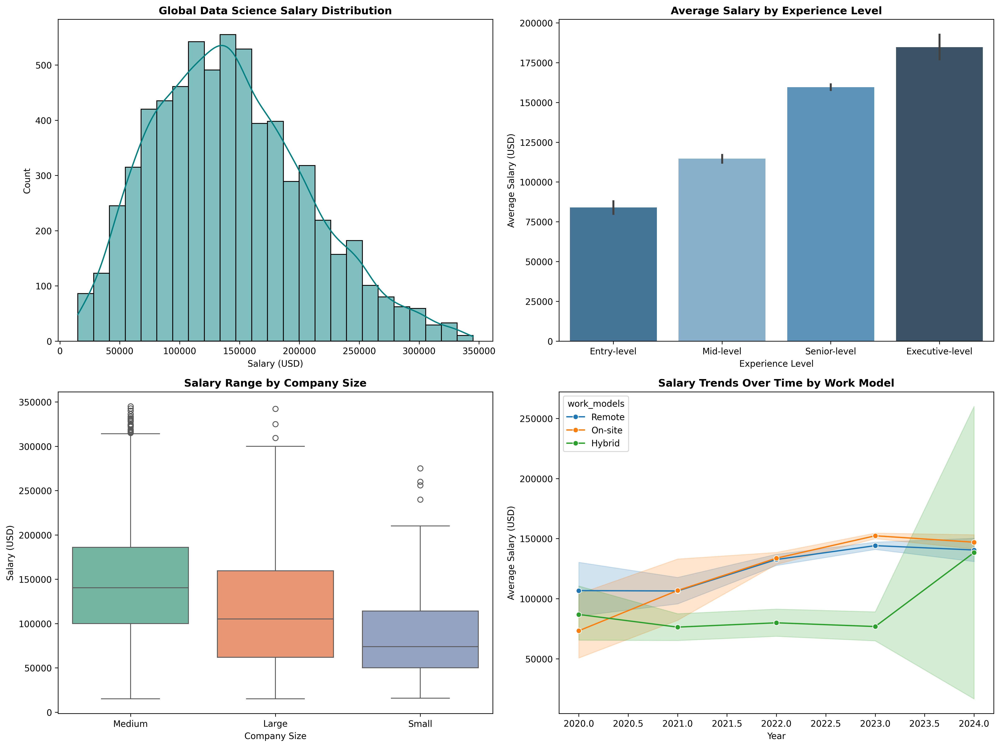

# Global Tech Compensation & Workforce Trends: An Exploratory Data Analysis (EDA)

## 📌 Project Overview
As the AI and Data Science markets rapidly evolve, understanding global compensation structures is critical for both talent acquisition and professional positioning. This project performs a comprehensive Exploratory Data Analysis (EDA) on a dataset of over 10,000 global tech salary records. The objective is to extract actionable insights regarding salary distributions, experience premiums, the impact of company size, and the evolution of hybrid/remote work models.

## 🛠️ Tech Stack & Tools Used
* **Python** (Core Analysis)
* **Pandas** & **NumPy** (Data Ingestion, Target Filtering, & Outlier Removal)
* **Matplotlib** & **Seaborn** (Advanced Object-Oriented Data Visualization)
* **Jupyter Notebook** (Prototyping & Documentation)

## 🧼 Data Pipeline & Engineering
To ensure high-quality visualizations and insights, the following data cleaning procedures were strictly executed:
1. **Integrity Checks:** Verified dataset for missing values (nulls) and duplicate rows to guarantee baseline consistency.
2. **Outlier Mitigation:** Identified extreme salary anomalies using the 99th percentile statistical threshold. In-memory data filtering was applied via Pandas to drop extreme values, preventing display distortion and ensuring a realistic representation of mainstream market wages.

## 📊 Executive Dashboard & Key Insights
Below is the unified analytical dashboard generated programmatically through a custom Matplotlib 2x2 grid layout.

### 💡 Core Findings for Strategy Teams:
* **The Salary Benchmark:** The global data science salary landscape centers tightly around a median range of \$100k–\$160k USD, with a visible right-skew demonstrating high-earning potential for niche technical roles.
* **The Experience Premium:** A massive jump in average compensation occurs between Mid-level and Senior-level roles, signaling that leadership and autonomous project delivery command the highest market premiums.
* **Corporate Scale Advantage:** Large and Medium enterprises share similar median wage caps, but Large organizations display a significantly higher floor, indicating stronger compensation stability for entry-level talent.
* **The Work-Model Shift:** Line charts over time reflect a flattening or minor correction in purely remote roles compared to a steady premium hold on hybrid/on-site positions in recent cycles, a vital metric for workforce planning.

## 🚀 How to Run the Project
1. Clone this repository: `git clone https://github.com/Timelord0000/global-tech-salary-eda.git`
3. Install dependencies: `pip install pandas matplotlib seaborn`
4. Execute the script or notebook to view/re-save the high-resolution visualization asset.
